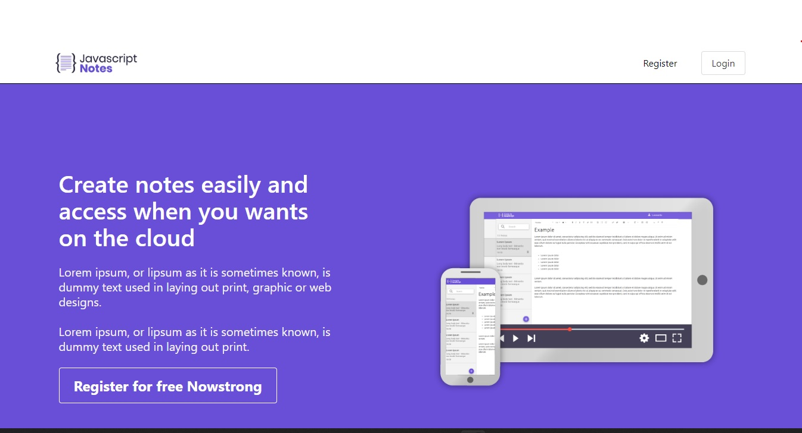
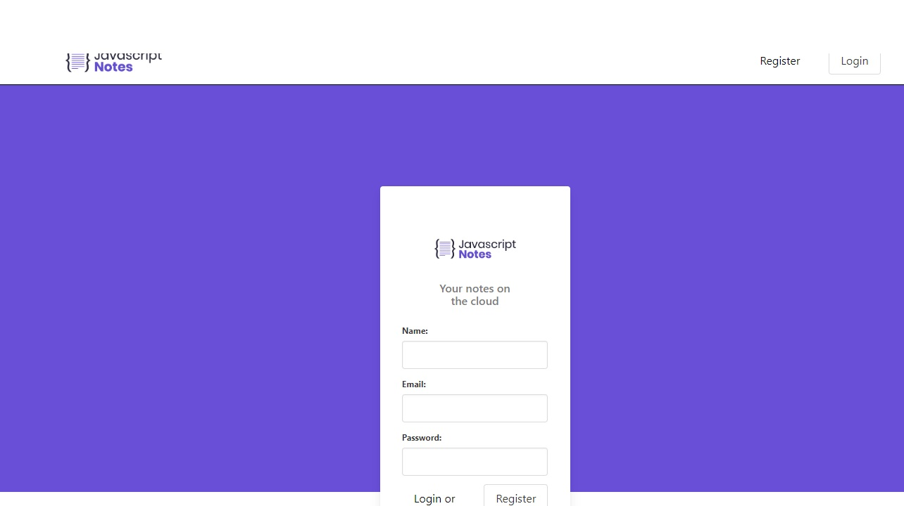
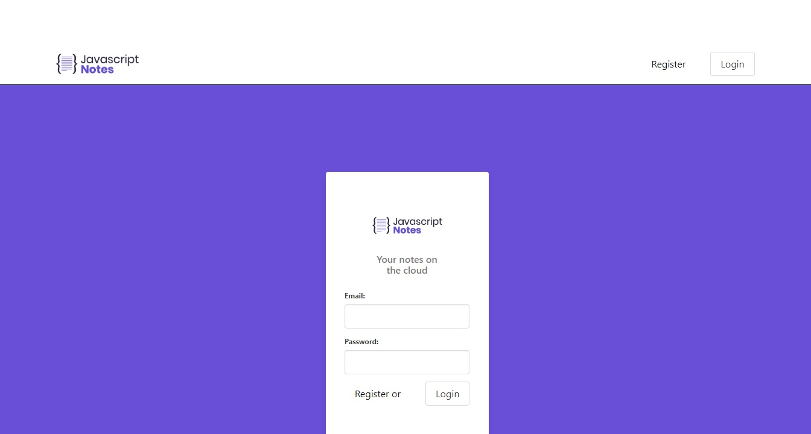

# Projeto-Evernote
 A ideia do projeto é  fazer um clone do Evernote, para que um usuário cadastrado possa criar suas notas e manipular da maneira que bem entender.

## Back-end
-Nodejs
-MongoDB para Banco de Dados

## Front-end
-React

## Funcionalidades
- Registrar usuário
- Logar usuário
- Criar notas
- Excluir notas
- Atualizar notas
- Pesquisar uma nota
## Home Screen

  

## Register Screen

  

## Login Screen

  

